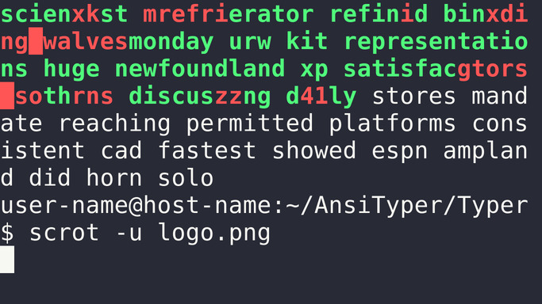

# AnsiTyper

AnsiTyper is a very basic Unix terminal WPM counter written in Python that utilizes ansi escape sequences to render the graphics into the terminal.

## Requirements

- Unix like system
- Support to ansi escape sequences
- Python >= 3.9

# Play

`python3 ~/AnsiTyper/Typer/main.py`

Same as 
`python3 ~/AnsiTyper/Typer/main.py --words=30`

## Options
- `-h, --help         → show this help message and exit`
- `-v, --version      → show program's version number and exit`
- `-w, --words        → number of words to type -> (default: 30)`

## Made by [Sivefunc](https://gitlab.com/sivefunc)
## Licensed under [GPLv3](LICENSE)
